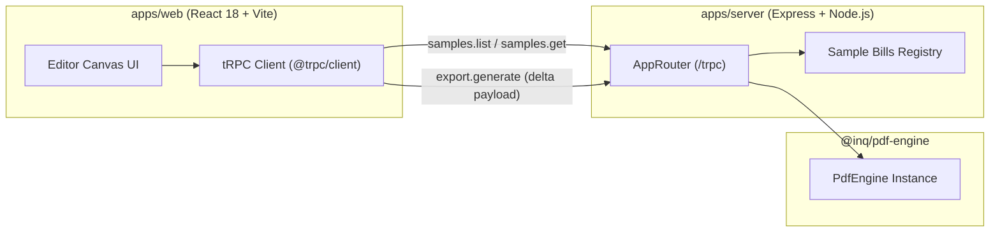

# Interprocess Communication (IPC) Architecture

This node details the communication layer between the frontend user interface (`apps/web`), the backend document management server (`apps/server`), and the vector PDF engine (`@inq/pdf-engine`).

## 1. Protocol Consideration & Trade-offs

| Protocol | Suitability for Inq BillEditor | Trade-off Analysis |
| :--- | :--- | :--- |
| **tRPC (Selected)** | **Optimal** | End-to-end compile-time type safety without code generators; transparent RPC calling over HTTP; directly consumes TypeScript types from `@inq/server` across Turborepo workspaces; zero schema drift. |
| **MQTT** | *Not recommended for single-user document editing* | Lightweight publish-subscribe protocol ideal for high-fanout IoT telemetry and intermittent networks. Introduces broker complexity (e.g. Mosquitto/EMQX) without RPC request-response benefits for binary document compilation. |
| **WebSockets** | *Reserved for future multi-user real-time collaboration* | Full-duplex persistent connection; valuable if multiple editors are concurrently modifying the same bill with operational transforms or CRDTs. Currently unneeded for single-tenant in-place bill editing. |
| **Isomorphic Direct Engine (Client-side Fallback)** | **Active Support** | Because `@inq/pdf-engine` and `pdf-lib` run purely in JavaScript/WebAssembly, `apps/web` can perform 100% of PDF vector generation locally in the browser with zero server latency, while utilizing tRPC for server-backed persistence and sample bill cataloging. |

## 2. tRPC Endpoint Topography

The tRPC router is defined in `apps/server/src/trpc/router.ts` and mounted at `/trpc`:

### Procedures Implemented:
1. `health`: Returns server status, version, and server timestamp.
2. `samples.list`: Returns metadata list of realistic sample bills (`saas-invoice`, `electric-utility`, `retail-receipt`).
3. `samples.get`: Resolves sample ID, returns base64 PDF bytes and metadata.
4. `export.generate`: Accepts modification delta (`ModificationDelta`), compiles vector PDF via `@inq/pdf-engine`, and returns base64 vector PDF stream for instant download.

## 3. Cross-References

- [System Architecture](./system-architecture.md)
- [Vector PDF Processing Engine](./pdf-engine-graph.md)
- [Knowledge Graph Index](./index.md)
