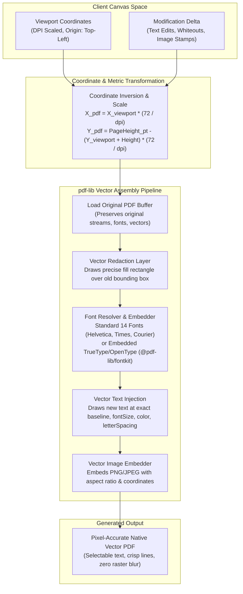

# PDF Engine Graph (`@inq/pdf-engine`)

This document describes the vector PDF modification pipeline, coordinate transformation logic, and TrueType font embedding workflow. For repository architecture, see [System Architecture](./system-architecture.md).

---

## Coordinate Mapping Formulas

| Dimension | Viewport Space (Web UI) | PDF Space (pdf-lib) |
| :--- | :--- | :--- |
| **Origin** | Top-Left `(0, 0)` | Bottom-Left `(0, 0)` |
| **Unit** | CSS Pixels (`px`) | Points (`pt`, 72 pt = 1 inch) |
| **X Coordinate** | `x_px` | `x_pt = x_px * scale` |
| **Y Coordinate** | `y_px` (increases downward) | `y_pt = pageHeight_pt - (y_px + height_px) * scale` |
| **Font Size** | `fontSize_px` | `fontSize_pt = fontSize_px * scale` |

Return to [Bundle Index](./index.md).
