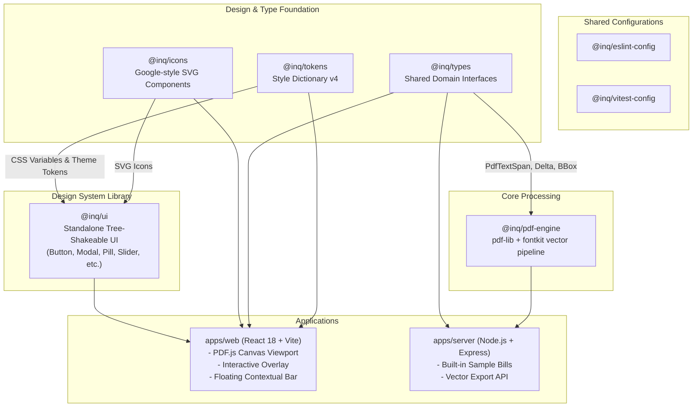

# System Architecture & Monorepo Topology

This document details the architectural layout, workspace boundaries, and dependency relationships for the `@inq` monorepo. For visual component relationships, see the [UI Component Graph](./ui-component-graph.md). For backend vector PDF generation details, see the [PDF Engine Graph](./pdf-engine-graph.md).

---

## Workspace Relationships & Roles

| Package / App | Category | Purpose | Consumes | Consumed By |
| :--- | :--- | :--- | :--- | :--- |
| `@inq/tokens` | Package | Brand & semantic design tokens (CSS vars + TS objects) | None | [UI Component Library](./ui-component-graph.md), `apps/web` |
| `@inq/icons` | Package | Scalable SVG React icons | None | [UI Component Library](./ui-component-graph.md), `apps/web` |
| `@inq/ui` | Package | Standalone, accessible, tree-shakeable UI component library | `@inq/tokens`, `@inq/icons` | `apps/web`, 3rd party apps |
| `@inq/types` | Package | TypeScript domain models, bounding boxes, modification deltas | None | [PDF Processing Engine](./pdf-engine-graph.md), `apps/web`, `apps/server` |
| `@inq/pdf-engine`| Package | Native vector PDF modification engine (`pdf-lib` + `fontkit`) | `@inq/types` | `apps/server` |
| `apps/web` | Application | Interactive React in-place visual PDF editor | `@inq/ui`, `@inq/icons`, `@inq/types`, `@inq/tokens` | End User Browser |
| `apps/server` | Application | Express API backend serving samples and compiling PDFs | `@inq/pdf-engine`, `@inq/types` | `apps/web` (HTTP) |

Return to [Bundle Index](./index.md).
