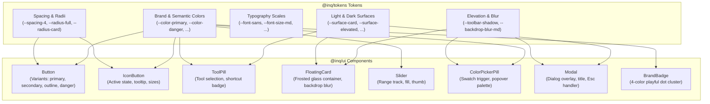

# UI Component Graph (`@inq/ui`)

This document visualizes component structures, design token integration, and testing patterns for `@inq/ui`. For system-wide package relationships, see the [System Architecture](./system-architecture.md).



---

## Component Colocation Contract

Each component adheres strictly to this 4-file contract:

```
packages/ui/src/components/<component-name>/
├── <ComponentName>.tsx        # React Component with semantic HTML and a11y roles
├── <ComponentName>.css        # Component styles consuming @inq/tokens CSS variables
├── <ComponentName>.test.tsx   # Vitest unit & accessibility tests (jsdom)
└── index.ts                   # Named subpath barrel export
```

## Scaffolding New Components

Components are generated via Plop.js:
```bash
npx plop component -- --name <ComponentName>
```
See [`AGENTS.md`](../AGENTS.md) for generation details.

Return to [Bundle Index](./index.md).
